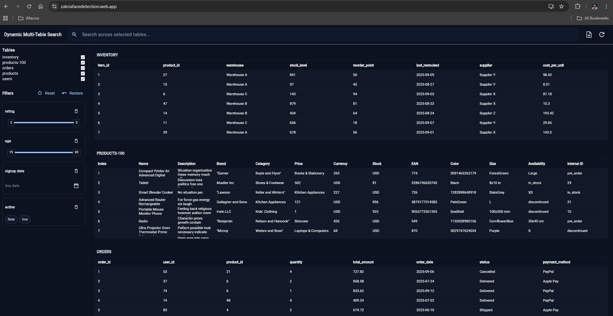
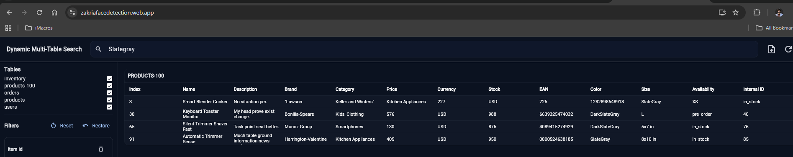

---

```markdown
# Design Choices & Thought Process (One Page)



## Goals
- Deliver a clean, fast **data explorer** for the browser with minimal friction (no backend).
- Keep the UI compact and scalable to multiple tables and formats.

## Architecture
- **Provider (`DataProvider`)**: single source of truth. Holds raw tables, selections, filters, global search query, and sort state. Produces computed **views** (filtered + sorted rows) asynchronously with a short debounce to keep UI responsive while typing/filtering.
- **Service (`DataService`)**: handles **file picking + parsing** for multiple formats (CSV/TSV/PSV/JSON/NDJSON/XLSX). JSON is flattened with dot-notation, XLSX emits one table per sheet.

## Schema Inference
- For each column, infer **integer / decimal / boolean / date / text**.
- Store numeric **min/max** and **distinct values** for text/bool (capped) to drive compact filter controls.

## Filters & Search
- **Global search** (substring, case-insensitive) across visible tables for free-form text discovery.
- **Auto filters** for non-text fields only:
  - **Number** → compact range slider with labeled square thumbs
  - **Boolean/Text** → chip sets (text columns intentionally excluded from filter UI)
  - **Date** → date range picker
- **Merged filters**: If multiple selected tables share the same header, render a **single** card (union of options, min/max). Updates propagate to all matching tables.
- **Hide/Restore**: Users can hide specific filter cards to declutter; a “Restore” button brings them back (session-only memory).

## Sorting
- Click a table header to toggle **ascending/descending**. Sort is **type-aware** (number/date/text) using the inferred schema.

## UX Details
- Small visual components: tiny chips, compact sliders, minimal padding, subtle icons.
- **Skeleton** / loading indicators while recomputing views.
- Async recompute ensures UI remains interactive even with multiple filters and larger tables.

## Supported Formats
- **Delimited**: `csv`, `tsv`, `psv` (delimiter inferred from extension)
- **JSON**: array of objects or **NDJSON** lines; nested objects flattened to dotted keys
- **XLSX**: each sheet becomes its own table (`file.xlsx::SheetName`)

## Implemented Feature List (as requested)
- Global text search across any field
- Additional filters for non-text fields (number/date/bool)
- Asc/desc sorting by clicking header labels
- Removable/restorable filters for a cleaner UI
- Include/exclude CSVs (tables) in search scope
- Multi-file support and multiple types: `csv`, `tsv`, `psv`, `json`, `ndjson`, `xlsx`
- Hosted ("https://zakriafacedetection.web.app")
- All core requirements implemented; some optimization opportunities remain
